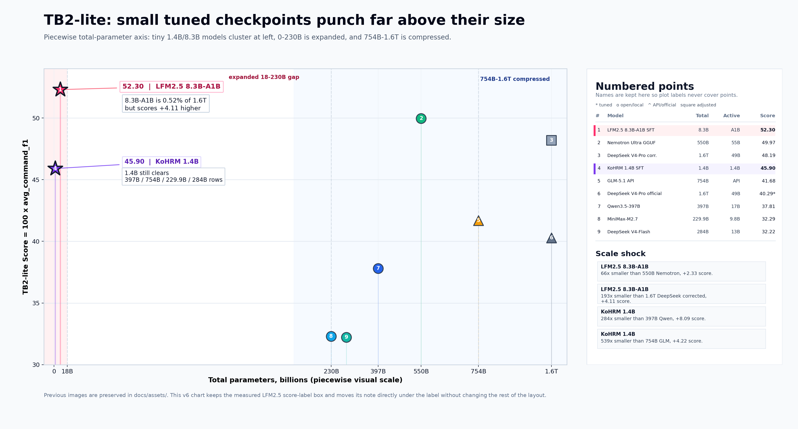

# TB2-lite Comprehensive Leaderboard Restore (2026-06-18)

Generated from git history and local TB2-lite JSON results on 2026-06-18.

## Summary

- Score definition: `Score = 100 * aggregate.avg_command_f1`.
- Archive source: `git show e0de35a270e7066ff456ab8edff6e826a66f0945:README.md`.
- Archive rows parsed: `113`.
- Local RLVR/eval JSON rows parsed: `542`.
- Main ranking rows after de-duplication and RLVR compression: `116`.
- RLVR checkpoint sweep rows moved out of the main ranking: `538`.
- Main ranking policy: RLVR checkpoint sweeps are represented by exactly three rows: best offline/static SFT1 RLVR, best online SFT1 RLVR, and best no-SFT raw RLVR. All other RLVR checkpoints are documented in the separate sweep report.
- Separate sweep report: [`docs/LFM25_ECHO_RLVR_SWEEP_ANALYSIS_20260618.ko.md`](LFM25_ECHO_RLVR_SWEEP_ANALYSIS_20260618.ko.md).
- Overall best row: `LLM-OS-Models/LFM2.5-8B-A1B-Terminal-ToolBench-Full-SFT-1Epoch + ECHO RLVR LoRA checkpoint-610` Score `54.05`.
- Representative RLVR rows: static `54.05` at checkpoint `610`, online `53.58` at checkpoint `425`, raw/no-SFT `46.06` at checkpoint `1475`.

## Restored Scale Visualization

The restored README visualization is kept here so the small tuned-model versus giant-model comparison is not lost. The detailed RLVR time/score graph is in the sweep report.

## Main Integrated Ranking

| Rank | Model / Checkpoint | Score | Cmd F1 | Precision | Recall | First Cmd | Valid JSON | Template | Sec/Step | Load(s) | Source | File |
| ---: | --- | ---: | ---: | ---: | ---: | ---: | ---: | --- | ---: | ---: | --- | --- |
| 1 | `LLM-OS-Models/LFM2.5-8B-A1B-Terminal-ToolBench-Full-SFT-1Epoch + ECHO RLVR LoRA checkpoint-610` | 54.05 | 0.5405 | 0.6021 | 0.5571 | 54.5% | 77.9% | chat_template+LoRA | 0.112 | 63.0 | static-json:parentrun-20260612 | tb2_lite/results/lfm25_echo_rlvr_gpu6_eval_20260612/lfm25-echo-rlvr-parentrun-checkpoint-610.json |
| 2 | `LLM-OS-Models/LFM2.5-8B-A1B-Terminal-ToolBench-Full-SFT-1Epoch + Online ECHO RLVR LoRA checkpoint-425` | 53.58 | 0.5358 | 0.5969 | 0.5478 | 49.2% | 77.2% | chat_template+LoRA | 0.112 | 58.4 | online-json:20260613 | tb2_lite/results/lfm25_echo_online_rlvr_gpu6_eval_20260613/lfm25-echo-online-sft1-checkpoint-425.json |
| 3 | `LLM-OS-Models/LFM2.5-8B-A1B-Terminal-ToolBench-Full-SFT-1Epoch` | 52.30 | 0.5230 | 0.5854 | 0.5431 | 49.5% | 76.9% | chat_template | 0.087 | 44.7 | archive-readme:e0de35a | git:e0de35a270e7066ff456ab8edff6e826a66f0945:README.md |
| 4 | `LLM-OS-Models/LFM2.5-8B-A1B-Terminal-ToolBench-Full-SFT-2Epoch` | 50.48 | 0.5048 | 0.5695 | 0.5296 | 49.2% | 74.9% | chat_template | 0.092 | 76.7 | archive-readme:e0de35a | git:e0de35a270e7066ff456ab8edff6e826a66f0945:README.md |
| 5 | `unsloth/NVIDIA-Nemotron-3-Ultra-550B-A55B-GGUF:UD-Q4_K_M` | 49.97 | 0.4997 | 0.6191 | 0.4785 | 49.2% | 81.5% | chat_template | 26.688 | 542.9 | archive-readme:e0de35a | git:e0de35a270e7066ff456ab8edff6e826a66f0945:README.md |
| 6 | `deepseek-ai/DeepSeek-V4-Pro (Valid-only 기능적 동등 보정, 162/303)` | 48.19* | 0.4819* | — | — | — | — | valid step 기능적 동등 분석 | — | — | archive-readme:e0de35a | git:e0de35a270e7066ff456ab8edff6e826a66f0945:README.md |
| 7 | `Zyphra/ZAYA1-74B-preview` | 48.15 | 0.4815 | 0.6196 | 0.5017 | 51.8% | 74.6% | chat_template | 4.151 | 1192.6 | archive-readme:e0de35a | git:e0de35a270e7066ff456ab8edff6e826a66f0945:README.md |
| 8 | `LiquidAI/LFM2.5-8B-A1B + Raw ECHO RLVR LoRA checkpoint-1475` | 46.06 | 0.4606 | 0.5437 | 0.4559 | 43.9% | 71.0% | chat_template+LoRA | 0.122 | 74.2 | static-json:raw-lfm25-20260612 | tb2_lite/results/lfm25_echo_rlvr_gpu6_eval_20260612/lfm25-echo-raw-lfm25-checkpoint-1475.json |
| 9 | `LLM-OS-Models/KoHRM-Text-1.4B-FullSFT-LFM25-Terminal-ToolBench-Epoch2` | 45.90 | 0.4590 | 0.5031 | 0.5098 | 44.9% | 68.3% | kohrm-local-prefixlm-export | 10.842 | 10.9 | archive-readme:e0de35a | git:e0de35a270e7066ff456ab8edff6e826a66f0945:README.md |
| 10 | `LLM-OS-Models/Qwen3.5-2B-Terminal-ToolCall-FullConv-FastContinue-1Epoch` | 44.79 | 0.4479 | 0.5266 | 0.4701 | 34.3% | 83.2% | chat_template | 0.079 | 15.5 | archive-readme:e0de35a | git:e0de35a270e7066ff456ab8edff6e826a66f0945:README.md |
| 11 | `LLM-OS-Models/KoHRM-Text-1.4B-FullSFT-LFM25-Terminal-ToolBench-Epoch3` | 43.57 | 0.4357 | 0.4703 | 0.5003 | 45.5% | 61.7% | kohrm-local-prefixlm-export-nocompile | 11.156 | 2.9 | archive-readme:e0de35a | git:e0de35a270e7066ff456ab8edff6e826a66f0945:README.md |
| 12 | `deepseek-ai/DeepSeek-V4-Pro (기능적 동등 보정, 162/303)` | 42.46* | 0.4246* | — | — | — | — | 기능적 동등 분석 | — | — | archive-readme:e0de35a | git:e0de35a270e7066ff456ab8edff6e826a66f0945:README.md |
| 13 | `GLM-5.1 (z.ai API)` | 41.68 | 0.4168 | 0.5377 | 0.4007 | 24.1% | 90.1% | anthropic-api | 3.298 | - | archive-readme:e0de35a | git:e0de35a270e7066ff456ab8edff6e826a66f0945:README.md |
| 14 | `deepseek-ai/DeepSeek-V4-Pro (chat t=0.0, m=4096, 공식, 162/303)` | 40.29* | 0.4029* | 0.5752 | 0.4112 | 45.1% | 44.7% | deepseek_official_mp8_chat_t0_m4096 | 689.3 | 15.0 | archive-readme:e0de35a | git:e0de35a270e7066ff456ab8edff6e826a66f0945:README.md |
| 15 | `LiquidAI/LFM2.5-8B-A1B raw rerun 20260612` | 39.92 | 0.3992 | 0.4679 | 0.4119 | 41.9% | 59.1% | chat_template | 0.092 | 30.6 | static-json:raw-base-rerun-20260612 | tb2_lite/results/lfm25_echo_rlvr_gpu6_eval_20260612/lfm25-raw-base-no-sft-rerun-20260612.json |
| 16 | `LLM-OS-Models/gemma-4-26B-A4B-it-Terminal-SFT-Native-Liquid-2Epoch` | 39.56 | 0.3956 | 0.4702 | 0.4808 | 40.6% | 17.2% | gemma4_native | 6.820 | 43.8 | archive-readme:e0de35a | git:e0de35a270e7066ff456ab8edff6e826a66f0945:README.md |
| 17 | `LLM-OS-Models/Qwen3.5-2B-Terminal-SFT-2Epoch-FullFT-SameCount` | 39.52 | 0.3952 | 0.5082 | 0.4101 | 33.0% | 82.2% | chat_template | 0.081 | 97.1 | archive-readme:e0de35a | git:e0de35a270e7066ff456ab8edff6e826a66f0945:README.md |
| 18 | `LLM-OS-Models/KoHRM-Text-1.4B-FullSFT-LFM25-Terminal-ToolBench-Epoch1` | 38.56 | 0.3856 | 0.4262 | 0.4341 | 37.0% | 55.1% | kohrm-local-prefixlm-export | 8.314 | 7.0 | archive-readme:e0de35a | git:e0de35a270e7066ff456ab8edff6e826a66f0945:README.md |
| 19 | `LLM-OS-Models/Qwen3.5-2B-Terminal-SFT-1Epoch-FullFT-SameCount` | 38.52 | 0.3852 | 0.4988 | 0.4056 | 32.7% | 83.2% | chat_template | 0.080 | 130.1 | archive-readme:e0de35a | git:e0de35a270e7066ff456ab8edff6e826a66f0945:README.md |
| 20 | `LLM-OS-Models/Qwen3.5-9B-Terminal-SFT-2Epoch-FullFT-2BData` | 38.26 | 0.3826 | 0.4620 | 0.3905 | 28.4% | 64.4% | chat_template | 0.293 | 377.3 | archive-readme:e0de35a | git:e0de35a270e7066ff456ab8edff6e826a66f0945:README.md |
| 21 | `LLM-OS-Models/gemma-4-26B-A4B-it-Terminal-SFT-Native-Liquid-1Epoch` | 38.12 | 0.3812 | 0.4405 | 0.4787 | 42.6% | 13.5% | gemma4_native | 6.854 | 38.8 | archive-readme:e0de35a | git:e0de35a270e7066ff456ab8edff6e826a66f0945:README.md |
| 22 | `Qwen/Qwen3.5-9B` | 38.10 | 0.3810 | 0.4921 | 0.3527 | 20.8% | 78.2% | chat_template | 0.268 | 123.8 | archive-readme:e0de35a | git:e0de35a270e7066ff456ab8edff6e826a66f0945:README.md |
| 23 | `nvidia/Nemotron-Terminal-32B` | 38.09 | 0.3809 | 0.5058 | 0.3827 | 40.3% | 58.7% | chat_template | 0.819 | 154.9 | archive-readme:e0de35a | git:e0de35a270e7066ff456ab8edff6e826a66f0945:README.md |
| 24 | `Qwen/Qwen3.5-397B-A17B-FP8` | 37.81 | 0.3781 | 0.5107 | 0.3443 | 21.5% | 86.1% | chat_template | 0.860 | 826.5 | archive-readme:e0de35a | git:e0de35a270e7066ff456ab8edff6e826a66f0945:README.md |
| 25 | `nvidia/Nemotron-Terminal-14B` | 37.70 | 0.3770 | 0.4688 | 0.3849 | 40.6% | 57.1% | chat_template | 0.360 | 98.8 | archive-readme:e0de35a | git:e0de35a270e7066ff456ab8edff6e826a66f0945:README.md |
| 26 | `Qwen/Qwen3.5-122B-A10B-FP8` | 37.28 | 0.3728 | 0.5155 | 0.3408 | 20.5% | 84.2% | chat_template | 0.655 | 746.9 | archive-readme:e0de35a | git:e0de35a270e7066ff456ab8edff6e826a66f0945:README.md |
| 27 | `DavidAU/Qwen3.6-40B-Claude-4.6-Opus-Deckard-Heretic-Uncensored-Thinking-NEO-CODE-Di-IMatrix-MAX-GGUF:Q4_K_M` | 37.09 | 0.3709 | 0.5010 | 0.3558 | 20.8% | 83.8% | chat_template | 14.422 | 141.5 | archive-readme:e0de35a | git:e0de35a270e7066ff456ab8edff6e826a66f0945:README.md |
| 28 | `LiquidAI/LFM2.5-8B-A1B` | 36.53 | 0.3653 | 0.4812 | 0.3685 | 39.9% | 59.1% | chat_template | 0.097 | 103.4 | archive-readme:e0de35a | git:e0de35a270e7066ff456ab8edff6e826a66f0945:README.md |
| 29 | `Qwen/Qwen3.5-35B-A3B-FP8` | 36.44 | 0.3644 | 0.5086 | 0.3317 | 23.1% | 77.6% | chat_template | 0.200 | 222.8 | archive-readme:e0de35a | git:e0de35a270e7066ff456ab8edff6e826a66f0945:README.md |
| 30 | `Qwen/Qwen3.5-35B-A3B` | 36.41 | 0.3641 | 0.5068 | 0.3330 | 22.1% | 78.2% | chat_template | 0.228 | 363.1 | archive-readme:e0de35a | git:e0de35a270e7066ff456ab8edff6e826a66f0945:README.md |
| 31 | `Qwen/Qwen3.5-27B` | 36.30 | 0.3630 | 0.4985 | 0.3343 | 22.1% | 74.9% | chat_template | 0.893 | 102.6 | archive-readme:e0de35a | git:e0de35a270e7066ff456ab8edff6e826a66f0945:README.md |
| 32 | `unsloth/Qwen3.6-27B-MTP-GGUF:UD-Q4_K_XL` | 36.29 | 0.3629 | 0.4813 | 0.3460 | 17.5% | 80.5% | chat_template | 5.577 | - | archive-readme:e0de35a | git:e0de35a270e7066ff456ab8edff6e826a66f0945:README.md |
| 33 | `LLM-OS-Models/Qwen3.5-4B-Terminal-SFT-2Epoch-FullFT-2BData` | 36.25 | 0.3625 | 0.4797 | 0.3723 | 26.1% | 61.7% | chat_template | 0.205 | 207.3 | archive-readme:e0de35a | git:e0de35a270e7066ff456ab8edff6e826a66f0945:README.md |
| 34 | `LLM-OS-Models/Qwen3.5-4B-Terminal-SFT-1Epoch-FullFT-2BData` | 36.05 | 0.3605 | 0.4601 | 0.3690 | 28.1% | 59.4% | chat_template | 0.206 | 158.5 | archive-readme:e0de35a | git:e0de35a270e7066ff456ab8edff6e826a66f0945:README.md |
| 35 | `nvidia/Nemotron-Terminal-8B` | 35.80 | 0.3580 | 0.4649 | 0.3592 | 35.3% | 54.5% | chat_template | 0.273 | 95.7 | archive-readme:e0de35a | git:e0de35a270e7066ff456ab8edff6e826a66f0945:README.md |
| 36 | `Jackrong/Qwen3.5-27B-Claude-4.6-Opus-Reasoning-Distilled` | 35.68 | 0.3568 | 0.4822 | 0.3313 | 22.8% | 74.6% | chat_template | 0.904 | 203.7 | archive-readme:e0de35a | git:e0de35a270e7066ff456ab8edff6e826a66f0945:README.md |
| 37 | `LLM-OS-Models/Ouro-2.6B-Thinking-Terminal-SFT` | 35.61 | 0.3561 | 0.4586 | 0.3647 | 25.1% | 61.1% | chat_template | 3.358 | 135.3 | archive-readme:e0de35a | git:e0de35a270e7066ff456ab8edff6e826a66f0945:README.md |
| 38 | `LLM-OS-Models/Qwen3.5-9B-Terminal-SFT-1Epoch-FullFT-2BData` | 35.60 | 0.3560 | 0.4537 | 0.3752 | 26.7% | 62.7% | chat_template | 0.291 | 179.0 | archive-readme:e0de35a | git:e0de35a270e7066ff456ab8edff6e826a66f0945:README.md |
| 39 | `LLM-OS-Models/gemma-4-31B-it-Terminal-SFT-Native-Liquid-1Epoch` | 35.55 | 0.3555 | 0.4650 | 0.3776 | 27.4% | 65.3% | gemma4_native | 3.924 | 41.4 | archive-readme:e0de35a | git:e0de35a270e7066ff456ab8edff6e826a66f0945:README.md |
| 40 | `DavidAU/Qwen3.6-27B-Heretic-Uncensored-FINETUNE-NEO-CODE-Di-IMatrix-MAX-GGUF:Q4_K_M` | 35.47 | 0.3547 | 0.4756 | 0.3397 | 17.8% | 78.9% | chat_template | 9.964 | 6.6 | archive-readme:e0de35a | git:e0de35a270e7066ff456ab8edff6e826a66f0945:README.md |
| 41 | `Jackrong/Qwopus3.6-35B-A3B-v1-GGUF:Q4_K_M` | 35.45 | 0.3545 | 0.4929 | 0.3287 | 18.5% | 81.2% | chat_template | 4.835 | 5.7 | archive-readme:e0de35a | git:e0de35a270e7066ff456ab8edff6e826a66f0945:README.md |
| 42 | `Qwen/Qwen3.5-4B` | 35.42 | 0.3542 | 0.4836 | 0.3292 | 17.8% | 75.6% | chat_template | 0.185 | 120.0 | archive-readme:e0de35a | git:e0de35a270e7066ff456ab8edff6e826a66f0945:README.md |
| 43 | `deepseek-ai/DeepSeek-V4-Pro (chat t=0.0, m=1024, 175/303)` | 35.40 | 0.3540 | 0.4872 | 0.3336 | 29.7% | 52.6% | deepseek_official_mp8_chat_t0 | 376.0 | 15.0 | archive-readme:e0de35a | git:e0de35a270e7066ff456ab8edff6e826a66f0945:README.md |
| 44 | `Qwen/Qwen3.5-2B` | 35.10 | 0.3510 | 0.4944 | 0.3220 | 18.2% | 81.8% | chat_template | 0.077 | 112.8 | archive-readme:e0de35a | git:e0de35a270e7066ff456ab8edff6e826a66f0945:README.md |
| 45 | `LLM-OS-Models/gemma-4-E4B-it-Terminal-SFT-Native-Liquid-2Epoch` | 34.98 | 0.3498 | 0.4737 | 0.3576 | 30.4% | 35.0% | gemma4_native | 0.277 | 53.2 | archive-readme:e0de35a | git:e0de35a270e7066ff456ab8edff6e826a66f0945:README.md |
| 46 | `LLM-OS-Models/gemma-4-E4B-it-Terminal-SFT-Native-Liquid-1Epoch` | 34.42 | 0.3442 | 0.4823 | 0.3397 | 27.1% | 45.5% | gemma4_native | 0.360 | 93.6 | archive-readme:e0de35a | git:e0de35a270e7066ff456ab8edff6e826a66f0945:README.md |
| 47 | `LLM-OS-Models/LFM2-24B-A2B-Terminal-SFT-1Epoch-HF-FSDP-TemplateMasked` | 33.46 | 0.3346 | 0.4363 | 0.3549 | 31.7% | 65.0% | chat_template | 0.177 | 220.0 | archive-readme:e0de35a | git:e0de35a270e7066ff456ab8edff6e826a66f0945:README.md |
| 48 | `LLM-OS-Models/LFM2-24B-A2B-Terminal-SFT-2Epoch-HF-FSDP-TemplateMasked` | 33.35 | 0.3335 | 0.4242 | 0.3590 | 26.1% | 66.3% | chat_template | 0.180 | 198.6 | archive-readme:e0de35a | git:e0de35a270e7066ff456ab8edff6e826a66f0945:README.md |
| 49 | `deepseek-ai/DeepSeek-V4-Pro (chat t=0.3, m=4096, 86/303)` | ~33* | 0.33* | — | — | — | 59.3% | deepseek_official_mp8_chat_t03_m4096 | 814.0 | 15.0 | archive-readme:e0de35a | git:e0de35a270e7066ff456ab8edff6e826a66f0945:README.md |
| 50 | `LLM-OS-Models/LFM2-2.6B-Terminal-SFT-2Epoch-LiquidCLI-TemplateHoldout` | 32.85 | 0.3285 | 0.4194 | 0.3336 | 31.0% | 55.4% | chat_template | 0.150 | 32.9 | archive-readme:e0de35a | git:e0de35a270e7066ff456ab8edff6e826a66f0945:README.md |
| 51 | `LLM-OS-Models/gemma-4-26B-A4B-it-Terminal-SFT-2Epoch-HF-FSDP-2BData` | 32.77 | 0.3277 | 0.3953 | 0.3541 | 18.2% | 24.8% | chat_template | 0.348 | 300.9 | archive-readme:e0de35a | git:e0de35a270e7066ff456ab8edff6e826a66f0945:README.md |
| 52 | `LLM-OS-Models/gemma-4-31B-it-Terminal-SFT-Native-Liquid-2Epoch` | 32.57 | 0.3257 | 0.4417 | 0.3396 | 30.7% | 61.7% | gemma4_native | 4.036 | 43.2 | archive-readme:e0de35a | git:e0de35a270e7066ff456ab8edff6e826a66f0945:README.md |
| 53 | `Qwen/Qwen3.6-27B` | 32.56 | 0.3256 | 0.4346 | 0.3149 | 15.8% | 73.9% | chat_template | 0.889 | 178.2 | archive-readme:e0de35a | git:e0de35a270e7066ff456ab8edff6e826a66f0945:README.md |
| 54 | `LLM-OS-Models/LFM2-8B-A1B-Terminal-SFT-1Epoch-LiquidCLI-TemplateHoldout` | 32.41 | 0.3241 | 0.4327 | 0.3220 | 29.4% | 56.8% | chat_template | 0.126 | 36.6 | archive-readme:e0de35a | git:e0de35a270e7066ff456ab8edff6e826a66f0945:README.md |
| 55 | `MiniMaxAI/MiniMax-M2.7` | 32.29 | 0.3229 | 0.4492 | 0.2940 | 13.5% | 70.6% | chat_template | 0.445 | 642.9 | archive-readme:e0de35a | git:e0de35a270e7066ff456ab8edff6e826a66f0945:README.md |
| 56 | `deepseek-ai/DeepSeek-V4-Flash` | 32.22 | 0.3222 | 0.4511 | 0.3037 | 24.4% | 44.2% | deepseek_official_mp4 | 178.033 | 15.6 | archive-readme:e0de35a | git:e0de35a270e7066ff456ab8edff6e826a66f0945:README.md |
| 57 | `LLM-OS-Models/LFM2-2.6B-Terminal-SFT-1Epoch-LiquidCLI-TemplateHoldout` | 31.86 | 0.3186 | 0.4102 | 0.3321 | 30.0% | 55.8% | chat_template | 0.151 | 33.0 | archive-readme:e0de35a | git:e0de35a270e7066ff456ab8edff6e826a66f0945:README.md |
| 58 | `LLM-OS-Models/Ouro-1.4B-Thinking-Terminal-SFT` | 31.74 | 0.3174 | 0.4062 | 0.3410 | 24.8% | 63.7% | chat_template | 1.698 | 92.4 | archive-readme:e0de35a | git:e0de35a270e7066ff456ab8edff6e826a66f0945:README.md |
| 59 | `LLM-OS-Models/KoHRM-Text-1.4B-FullSFT-Top2-Terminal-Tool-Merge-Epoch1` | 31.59 | 0.3159 | 0.3859 | 0.3415 | 24.8% | 73.3% | kohrm-local-prefixlm-export | 7.5 | 7.3 | archive-readme:e0de35a | git:e0de35a270e7066ff456ab8edff6e826a66f0945:README.md |
| 60 | `LLM-OS-Models/LFM2-8B-A1B-Terminal-SFT-2Epoch-LiquidCLI-TemplateHoldout` | 31.02 | 0.3102 | 0.4063 | 0.3201 | 29.0% | 54.8% | chat_template | 0.126 | 35.7 | archive-readme:e0de35a | git:e0de35a270e7066ff456ab8edff6e826a66f0945:README.md |
| 61 | `LLM-OS-Models/LFM2-8B-Terminal-SFT-2Epoch-LiquidCLI-TemplateHoldout-7GPU` | 31.02 | 0.3102 | 0.4063 | 0.3201 | 29.0% | 54.8% | chat_template | 0.128 | 131.5 | archive-readme:e0de35a | git:e0de35a270e7066ff456ab8edff6e826a66f0945:README.md |
| 62 | `Qwen/Qwen3.6-35B-A3B-FP8` | 30.57 | 0.3057 | 0.4248 | 0.2873 | 14.5% | 75.2% | chat_template | 0.203 | 181.9 | archive-readme:e0de35a | git:e0de35a270e7066ff456ab8edff6e826a66f0945:README.md |
| 63 | `Qwen/Qwen3.6-35B-A3B` | 30.28 | 0.3028 | 0.4093 | 0.2879 | 14.2% | 73.3% | chat_template | 0.234 | 360.2 | archive-readme:e0de35a | git:e0de35a270e7066ff456ab8edff6e826a66f0945:README.md |
| 64 | `LLM-OS-Models/Ouro-2.6B-Terminal-SFT` | 29.58 | 0.2958 | 0.3624 | 0.3156 | 22.8% | 29.4% | chat_template | 5.154 | 332.6 | archive-readme:e0de35a | git:e0de35a270e7066ff456ab8edff6e826a66f0945:README.md |
| 65 | `KoHRM-Text-1.4B-stage4d + terminal-tool-core-r64 LoRA` | 29.11 | 0.2911 | 0.3988 | 0.2768 | 22.1% | 63.4% | kohrm-local-lora-prefixlm | 17.217 | 23.2 | archive-readme:e0de35a | git:e0de35a270e7066ff456ab8edff6e826a66f0945:README.md |
| 66 | `LLM-OS-Models/gemma-4-31B-Terminal-SFT-Native-Liquid-2Epoch` | 28.96 | 0.2896 | 0.3829 | 0.3254 | 24.4% | 26.4% | gemma4_native | 5.950 | 43.2 | archive-readme:e0de35a | git:e0de35a270e7066ff456ab8edff6e826a66f0945:README.md |
| 67 | `KoHRM-Text-1.4B-stage4d + terminal-comp-jsonfix-r64 LoRA` | 28.80 | 0.2880 | 0.3834 | 0.2878 | 24.4% | 66.7% | kohrm-local-lora-prefixlm | 17.564 | 23.4 | archive-readme:e0de35a | git:e0de35a270e7066ff456ab8edff6e826a66f0945:README.md |
| 68 | `LLM-OS-Models/LFM2.5-1.2B-Terminal-SFT-2Epoch-LiquidCLI-TemplateHoldout` | 28.64 | 0.2864 | 0.3775 | 0.2904 | 29.0% | 50.5% | chat_template | 0.086 | 25.4 | archive-readme:e0de35a | git:e0de35a270e7066ff456ab8edff6e826a66f0945:README.md |
| 69 | `LLM-OS-Models/LFM2.5-1.2B-Terminal-SFT-2Epoch-LiquidCLI-TemplateHoldout-8GPU` | 28.64 | 0.2864 | 0.3775 | 0.2904 | 29.0% | 50.5% | chat_template | 0.085 | 49.9 | archive-readme:e0de35a | git:e0de35a270e7066ff456ab8edff6e826a66f0945:README.md |
| 70 | `google/gemma-4-12B-it` | 28.58 | 0.2858 | 0.3512 | 0.3324 | 17.5% | 23.4% | gemma4text_fallback | 9.163 | 166.1 | archive-readme:e0de35a | git:e0de35a270e7066ff456ab8edff6e826a66f0945:README.md |
| 71 | `google/gemma-4-26B-A4B-it` | 28.51 | 0.2851 | 0.4057 | 0.2643 | 14.2% | 71.9% | chat_template | 0.277 | 747.8 | archive-readme:e0de35a | git:e0de35a270e7066ff456ab8edff6e826a66f0945:README.md |
| 72 | `KoHRM-Text-1.4B-stage4d + comp-terminal-80m LoRA` | 28.44 | 0.2844 | 0.3718 | 0.2803 | 22.8% | 67.3% | kohrm-local-lora-prefixlm | 17.004 | 20.1 | archive-readme:e0de35a | git:e0de35a270e7066ff456ab8edff6e826a66f0945:README.md |
| 73 | `LLM-OS-Models/Ouro-1.4B-terminal-sft` | 28.30 | 0.2830 | 0.3520 | 0.3141 | 22.4% | 27.1% | chat_template | 2.344 | 83.1 | archive-readme:e0de35a | git:e0de35a270e7066ff456ab8edff6e826a66f0945:README.md |
| 74 | `gyung/LFM2-8B-Terminal-SFT-Unsloth` | 28.23 | 0.2823 | 0.3817 | 0.2851 | 27.1% | 53.8% | chat_template | 0.124 | 36.0 | archive-readme:e0de35a | git:e0de35a270e7066ff456ab8edff6e826a66f0945:README.md |
| 75 | `Jiunsong/supergemma4-26b-uncensored-gguf-v2:Q4_K_M` | 28.21 | 0.2821 | 0.4135 | 0.2506 | 14.5% | 53.8% | gemma4_native | 5.688 | 7.5 | archive-readme:e0de35a | git:e0de35a270e7066ff456ab8edff6e826a66f0945:README.md |
| 76 | `LLM-OS-Models/LFM2.5-1.2B-Terminal-SFT-1Epoch-LiquidCLI-TemplateHoldout` | 28.10 | 0.2810 | 0.3615 | 0.2941 | 29.4% | 50.5% | chat_template | 0.085 | 25.4 | archive-readme:e0de35a | git:e0de35a270e7066ff456ab8edff6e826a66f0945:README.md |
| 77 | `LLM-OS-Models/LFM2-8B-Terminal-SFT-2Epoch-Unsloth` | 27.33 | 0.2733 | 0.3526 | 0.2872 | 24.1% | 62.0% | chat_template | 0.124 | 267.1 | archive-readme:e0de35a | git:e0de35a270e7066ff456ab8edff6e826a66f0945:README.md |
| 78 | `LLM-OS-Models/LFM2-2.6B-Terminal-SFT-2Epoch-Unsloth` | 27.31 | 0.2731 | 0.3643 | 0.2804 | 21.8% | 62.0% | chat_template | 0.147 | 69.7 | archive-readme:e0de35a | git:e0de35a270e7066ff456ab8edff6e826a66f0945:README.md |
| 79 | `LLM-OS-Models/gemma-4-26B-A4B-it-Terminal-SFT-1Epoch-HF-FSDP-2BData` | 27.28 | 0.2728 | 0.3389 | 0.3062 | 10.2% | 13.9% | chat_template | 0.379 | 269.7 | archive-readme:e0de35a | git:e0de35a270e7066ff456ab8edff6e826a66f0945:README.md |
| 80 | `KoHRM-Text-1.4B-stage4d + terminal-tool-jsonfix-r32 LoRA` | 27.15 | 0.2715 | 0.3831 | 0.2574 | 20.8% | 64.4% | kohrm-local-lora-prefixlm | 16.990 | 23.1 | archive-readme:e0de35a | git:e0de35a270e7066ff456ab8edff6e826a66f0945:README.md |
| 81 | `deepseek-ai/DeepSeek-V4-Pro (thinking t=1.0, 301/303)` | 26.66 | 0.2666 | 0.3733 | 0.2366 | 23.5% | 31.0% | deepseek_official_mp8 | 441.6 | 15.0 | archive-readme:e0de35a | git:e0de35a270e7066ff456ab8edff6e826a66f0945:README.md |
| 82 | `google/gemma-4-31B-it` | 26.33 | 0.2633 | 0.3513 | 0.2571 | 10.9% | 67.3% | chat_template | 1.362 | 845.5 | archive-readme:e0de35a | git:e0de35a270e7066ff456ab8edff6e826a66f0945:README.md |
| 83 | `LLM-OS-Models/LFM2-24B-A2B-Terminal-SFT-2Epoch-HF-FSDP-2BData` | 26.27 | 0.2627 | 0.3581 | 0.2681 | 16.8% | 58.1% | chat_template | 0.179 | 227.6 | archive-readme:e0de35a | git:e0de35a270e7066ff456ab8edff6e826a66f0945:README.md |
| 84 | `KoHRM-Text-1.4B-stage4d + behavior-jsonfix-r32 LoRA` | 26.23 | 0.2623 | 0.3807 | 0.2507 | 21.1% | 71.0% | kohrm-local-lora-prefixlm | 15.954 | 22.3 | archive-readme:e0de35a | git:e0de35a270e7066ff456ab8edff6e826a66f0945:README.md |
| 85 | `LLM-OS-Models/gemma-4-E2B-it-Terminal-SFT-Native-Liquid-1Epoch` | 25.70 | 0.2570 | 0.3615 | 0.2717 | 15.2% | 34.3% | gemma4_native | 0.325 | 51.8 | archive-readme:e0de35a | git:e0de35a270e7066ff456ab8edff6e826a66f0945:README.md |
| 86 | `LLM-OS-Models/gemma-4-E2B-it-Terminal-SFT-Native-Liquid-2Epoch` | 24.92 | 0.2492 | 0.3667 | 0.2447 | 11.6% | 34.0% | gemma4_native | 0.317 | 51.8 | archive-readme:e0de35a | git:e0de35a270e7066ff456ab8edff6e826a66f0945:README.md |
| 87 | `LLM-OS-Models/LFM2-24B-A2B-Terminal-SFT-1Epoch-HF-FSDP-2BData` | 24.74 | 0.2474 | 0.3390 | 0.2456 | 12.5% | 56.1% | chat_template | 0.178 | 228.6 | archive-readme:e0de35a | git:e0de35a270e7066ff456ab8edff6e826a66f0945:README.md |
| 88 | `KoHRM-Text-1.4B-stage4d + behavior-core-r64 LoRA` | 24.68 | 0.2468 | 0.3409 | 0.2405 | 21.8% | 64.4% | kohrm-local-lora-prefixlm | 16.974 | 23.0 | archive-readme:e0de35a | git:e0de35a270e7066ff456ab8edff6e826a66f0945:README.md |
| 89 | `LLM-OS-Models/LFM2.5-1.2B-Terminal-SFT-2Epoch-Unsloth` | 22.45 | 0.2245 | 0.3097 | 0.2314 | 18.8% | 47.2% | chat_template | 0.083 | 57.2 | archive-readme:e0de35a | git:e0de35a270e7066ff456ab8edff6e826a66f0945:README.md |
| 90 | `LLM-OS-Models/gemma-4-31B-Terminal-SFT-Native-Liquid-1Epoch` | 21.08 | 0.2108 | 0.2886 | 0.2422 | 11.2% | 21.1% | gemma4_native | 5.650 | 44.7 | archive-readme:e0de35a | git:e0de35a270e7066ff456ab8edff6e826a66f0945:README.md |
| 91 | `Zyphra/ZAYA1-8B` | 20.61 | 0.2061 | 0.2844 | 0.2117 | 17.5% | 35.3% | chat_template | 2.339 | 598.3 | archive-readme:e0de35a | git:e0de35a270e7066ff456ab8edff6e826a66f0945:README.md |
| 92 | `inclusionAI/LLaDA2.1-flash` | 20.07 | 0.2007 | 0.3150 | 0.1819 | 11.2% | 28.7% | sglang_llada_suffix | 2.502 | - | archive-readme:e0de35a | git:e0de35a270e7066ff456ab8edff6e826a66f0945:README.md |
| 93 | `LLM-OS-Models/gemma-4-26B-A4B-Terminal-SFT-Native-Liquid-2Epoch` | 19.52 | 0.1952 | 0.2626 | 0.2091 | 15.5% | 25.7% | gemma4_native | 7.116 | 36.0 | archive-readme:e0de35a | git:e0de35a270e7066ff456ab8edff6e826a66f0945:README.md |
| 94 | `google/gemma-4-E4B-it` | 19.36 | 0.1936 | 0.3184 | 0.1822 | 11.6% | 54.8% | chat_template | 0.205 | 175.8 | archive-readme:e0de35a | git:e0de35a270e7066ff456ab8edff6e826a66f0945:README.md |
| 95 | `JetBrains/Mellum2-12B-A2.5B-Thinking` | 18.96 | 0.1896 | 0.2682 | 0.2023 | 15.5% | 35.3% | chat_template | 4.536 | 138.4 | archive-readme:e0de35a | git:e0de35a270e7066ff456ab8edff6e826a66f0945:README.md |
| 96 | `stepfun-ai/Step-3.5-Flash` | 18.80 | 0.1880 | 0.2710 | 0.1790 | 13.9% | 27.4% | step3p5_vllm_bf16 | 5.368 | - | archive-readme:e0de35a | git:e0de35a270e7066ff456ab8edff6e826a66f0945:README.md |
| 97 | `LLM-OS-Models/gemma-4-26B-A4B-Terminal-SFT-Native-Liquid-1Epoch` | 18.66 | 0.1866 | 0.2370 | 0.2152 | 14.5% | 25.1% | gemma4_native | 7.020 | 45.3 | archive-readme:e0de35a | git:e0de35a270e7066ff456ab8edff6e826a66f0945:README.md |
| 98 | `LLM-OS-Models/gemma-4-E4B-Terminal-SFT-Native-Liquid-2Epoch` | 18.47 | 0.1847 | 0.2514 | 0.1980 | 16.8% | 17.2% | gemma4_native | 0.302 | 52.6 | archive-readme:e0de35a | git:e0de35a270e7066ff456ab8edff6e826a66f0945:README.md |
| 99 | `google/gemma-4-E2B-it` | 17.40 | 0.1740 | 0.2918 | 0.1613 | 7.3% | 57.1% | chat_template | 0.148 | 139.6 | archive-readme:e0de35a | git:e0de35a270e7066ff456ab8edff6e826a66f0945:README.md |
| 100 | `LiquidAI/LFM2-2.6B` | 17.06 | 0.1706 | 0.2229 | 0.2160 | 12.9% | 29.4% | chat_template | 0.152 | 55.0 | archive-readme:e0de35a | git:e0de35a270e7066ff456ab8edff6e826a66f0945:README.md |
| 101 | `LLM-OS-Models/gemma-4-E2B-Terminal-SFT-Native-Liquid-2Epoch` | 16.22 | 0.1622 | 0.2747 | 0.1678 | 15.2% | 16.2% | gemma4_native | 0.289 | 73.4 | archive-readme:e0de35a | git:e0de35a270e7066ff456ab8edff6e826a66f0945:README.md |
| 102 | `ByteDance/Ouro-1.4B` | 15.06 | 0.1506 | 0.1988 | 0.1625 | 8.9% | 37.3% | chat_template | 1.946 | 74.8 | archive-readme:e0de35a | git:e0de35a270e7066ff456ab8edff6e826a66f0945:README.md |
| 103 | `LiquidAI/LFM2.5-1.2B-Instruct` | 14.46 | 0.1446 | 0.2374 | 0.1526 | 10.6% | 60.1% | chat_template | 0.056 | 39.8 | archive-readme:e0de35a | git:e0de35a270e7066ff456ab8edff6e826a66f0945:README.md |
| 104 | `LLM-OS-Models/gemma-4-E4B-Terminal-SFT-Native-Liquid-1Epoch` | 12.80 | 0.1280 | 0.1792 | 0.1364 | 10.2% | 14.2% | gemma4_native | 0.383 | 93.8 | archive-readme:e0de35a | git:e0de35a270e7066ff456ab8edff6e826a66f0945:README.md |
| 105 | `ByteDance/Ouro-1.4B-Thinking` | 12.69 | 0.1269 | 0.2026 | 0.1299 | 9.2% | 26.7% | chat_template | 2.115 | 65.9 | archive-readme:e0de35a | git:e0de35a270e7066ff456ab8edff6e826a66f0945:README.md |
| 106 | `KoHRM-Text-1.4B-stage4d direct` | 11.48 | 0.1148 | 0.1995 | 0.0961 | 5.9% | 38.9% | kohrm-local-prefixlm | 14.001 | 13.0 | archive-readme:e0de35a | git:e0de35a270e7066ff456ab8edff6e826a66f0945:README.md |
| 107 | `LLM-OS-Models/gemma-4-E2B-Terminal-SFT-Native-Liquid-1Epoch` | 11.35 | 0.1135 | 0.1767 | 0.1191 | 6.6% | 7.3% | gemma4_native | 0.219 | 45.3 | archive-readme:e0de35a | git:e0de35a270e7066ff456ab8edff6e826a66f0945:README.md |
| 108 | `LiquidAI/LFM2-24B-A2B` | 10.87 | 0.1087 | 0.1466 | 0.1163 | 5.3% | 54.5% | chat_template | 0.165 | 236.2 | archive-readme:e0de35a | git:e0de35a270e7066ff456ab8edff6e826a66f0945:README.md |
| 109 | `LLM-OS-Models/gemma-4-E2B-it-Terminal-SFT-1Epoch-HF-FSDP-2BData` | 10.67 | 0.1067 | 0.1507 | 0.1067 | 4.0% | 5.9% | chat_template | 0.185 | 65.7 | archive-readme:e0de35a | git:e0de35a270e7066ff456ab8edff6e826a66f0945:README.md |
| 110 | `KoHRM-Text-1.4B-stage4d synth,cot` | 10.36 | 0.1036 | 0.1696 | 0.0878 | 4.0% | 36.0% | kohrm-local-prefixlm | 14.406 | 12.0 | archive-readme:e0de35a | git:e0de35a270e7066ff456ab8edff6e826a66f0945:README.md |
| 111 | `LiquidAI/LFM2-8B-A1B` | 10.04 | 0.1004 | 0.1405 | 0.1223 | 5.9% | 27.4% | chat_template | 0.124 | 61.9 | archive-readme:e0de35a | git:e0de35a270e7066ff456ab8edff6e826a66f0945:README.md |
| 112 | `LLM-OS-Models/gemma-4-E2B-it-Terminal-SFT-2Epoch-HF-FSDP-2BData` | 9.22 | 0.0922 | 0.1249 | 0.1023 | 3.3% | 5.9% | chat_template | 0.184 | 67.5 | archive-readme:e0de35a | git:e0de35a270e7066ff456ab8edff6e826a66f0945:README.md |
| 113 | `ByteDance/Ouro-2.6B` | 6.46 | 0.0646 | 0.0976 | 0.0692 | 5.0% | 16.5% | chat_template | 4.607 | 99.6 | archive-readme:e0de35a | git:e0de35a270e7066ff456ab8edff6e826a66f0945:README.md |
| 114 | `sapientinc/HRM-Text-1B` | 0.40 | 0.0040 | 0.0057 | 0.0040 | 1.3% | 4.3% | hrm_text_prefixlm | 3.976 | 4.4 | archive-readme:e0de35a | git:e0de35a270e7066ff456ab8edff6e826a66f0945:README.md |
| 115 | `LLM-OS-Models/gemma-4-31B-it-Terminal-SFT-1Epoch-HF-FSDP-2BData` | 0.00 | 0.0000 | 0.0000 | 0.0000 | 0.0% | 0.0% | chat_template | 1.774 | 300.1 | archive-readme:e0de35a | git:e0de35a270e7066ff456ab8edff6e826a66f0945:README.md |
| 116 | `LLM-OS-Models/gemma-4-31B-it-Terminal-SFT-2Epoch-HF-FSDP-2BData` | 0.00 | 0.0000 | 0.0000 | 0.0000 | 0.0% | 0.0% | chat_template | 1.770 | 300.1 | archive-readme:e0de35a | git:e0de35a270e7066ff456ab8edff6e826a66f0945:README.md |

## RLVR Rows Kept In Main Ranking

| Rank | Model / Checkpoint | Score | Cmd F1 | Precision | Recall | First Cmd | Valid JSON | Template | Sec/Step | Load(s) | Source | File |
| ---: | --- | ---: | ---: | ---: | ---: | ---: | ---: | --- | ---: | ---: | --- | --- |
| 1 | `LLM-OS-Models/LFM2.5-8B-A1B-Terminal-ToolBench-Full-SFT-1Epoch + ECHO RLVR LoRA checkpoint-610` | 54.05 | 0.5405 | 0.6021 | 0.5571 | 54.5% | 77.9% | chat_template+LoRA | 0.112 | 63.0 | static-json:parentrun-20260612 | tb2_lite/results/lfm25_echo_rlvr_gpu6_eval_20260612/lfm25-echo-rlvr-parentrun-checkpoint-610.json |
| 2 | `LLM-OS-Models/LFM2.5-8B-A1B-Terminal-ToolBench-Full-SFT-1Epoch + Online ECHO RLVR LoRA checkpoint-425` | 53.58 | 0.5358 | 0.5969 | 0.5478 | 49.2% | 77.2% | chat_template+LoRA | 0.112 | 58.4 | online-json:20260613 | tb2_lite/results/lfm25_echo_online_rlvr_gpu6_eval_20260613/lfm25-echo-online-sft1-checkpoint-425.json |
| 3 | `LiquidAI/LFM2.5-8B-A1B + Raw ECHO RLVR LoRA checkpoint-1475` | 46.06 | 0.4606 | 0.5437 | 0.4559 | 43.9% | 71.0% | chat_template+LoRA | 0.122 | 74.2 | static-json:raw-lfm25-20260612 | tb2_lite/results/lfm25_echo_rlvr_gpu6_eval_20260612/lfm25-echo-raw-lfm25-checkpoint-1475.json |

## Original README Table Recovered From Git

| Rank | Model / Checkpoint | Score | Cmd F1 | Precision | Recall | First Cmd | Valid JSON | Template | Sec/Step | Load(s) | Source |
| ---: | --- | ---: | ---: | ---: | ---: | ---: | ---: | --- | ---: | ---: | --- |
| 1 | `LLM-OS-Models/LFM2.5-8B-A1B-Terminal-ToolBench-Full-SFT-1Epoch + ECHO RLVR LoRA checkpoint-610` | 54.05 | 0.5405 | 0.6021 | 0.5571 | 54.5% | 77.9% | chat_template+LoRA | 0.112 | 63.0 | archive-readme:e0de35a |
| 2 | `LLM-OS-Models/LFM2.5-8B-A1B-Terminal-ToolBench-Full-SFT-1Epoch` | 52.30 | 0.5230 | 0.5854 | 0.5431 | 49.5% | 76.9% | chat_template | 0.087 | 44.7 | archive-readme:e0de35a |
| 3 | `LLM-OS-Models/LFM2.5-8B-A1B-Terminal-ToolBench-Full-SFT-2Epoch` | 50.48 | 0.5048 | 0.5695 | 0.5296 | 49.2% | 74.9% | chat_template | 0.092 | 76.7 | archive-readme:e0de35a |
| 4 | `unsloth/NVIDIA-Nemotron-3-Ultra-550B-A55B-GGUF:UD-Q4_K_M` | 49.97 | 0.4997 | 0.6191 | 0.4785 | 49.2% | 81.5% | chat_template | 26.688 | 542.9 | archive-readme:e0de35a |
| 5 | `deepseek-ai/DeepSeek-V4-Pro (Valid-only 기능적 동등 보정, 162/303)` | 48.19* | 0.4819* | — | — | — | — | valid step 기능적 동등 분석 | — | — | archive-readme:e0de35a |
| 6 | `Zyphra/ZAYA1-74B-preview` | 48.15 | 0.4815 | 0.6196 | 0.5017 | 51.8% | 74.6% | chat_template | 4.151 | 1192.6 | archive-readme:e0de35a |
| 7 | `LLM-OS-Models/KoHRM-Text-1.4B-FullSFT-LFM25-Terminal-ToolBench-Epoch2` | 45.90 | 0.4590 | 0.5031 | 0.5098 | 44.9% | 68.3% | kohrm-local-prefixlm-export | 10.842 | 10.9 | archive-readme:e0de35a |
| 8 | `LLM-OS-Models/Qwen3.5-2B-Terminal-ToolCall-FullConv-FastContinue-1Epoch` | 44.79 | 0.4479 | 0.5266 | 0.4701 | 34.3% | 83.2% | chat_template | 0.079 | 15.5 | archive-readme:e0de35a |
| 9 | `LLM-OS-Models/KoHRM-Text-1.4B-FullSFT-LFM25-Terminal-ToolBench-Epoch3` | 43.57 | 0.4357 | 0.4703 | 0.5003 | 45.5% | 61.7% | kohrm-local-prefixlm-export-nocompile | 11.156 | 2.9 | archive-readme:e0de35a |
| 10 | `deepseek-ai/DeepSeek-V4-Pro (기능적 동등 보정, 162/303)` | 42.46* | 0.4246* | — | — | — | — | 기능적 동등 분석 | — | — | archive-readme:e0de35a |
| 11 | `GLM-5.1 (z.ai API)` | 41.68 | 0.4168 | 0.5377 | 0.4007 | 24.1% | 90.1% | anthropic-api | 3.298 | - | archive-readme:e0de35a |
| 12 | `deepseek-ai/DeepSeek-V4-Pro (chat t=0.0, m=4096, 공식, 162/303)` | 40.29* | 0.4029* | 0.5752 | 0.4112 | 45.1% | 44.7% | deepseek_official_mp8_chat_t0_m4096 | 689.3 | 15.0 | archive-readme:e0de35a |
| 13 | `LLM-OS-Models/gemma-4-26B-A4B-it-Terminal-SFT-Native-Liquid-2Epoch` | 39.56 | 0.3956 | 0.4702 | 0.4808 | 40.6% | 17.2% | gemma4_native | 6.820 | 43.8 | archive-readme:e0de35a |
| 14 | `LLM-OS-Models/Qwen3.5-2B-Terminal-SFT-2Epoch-FullFT-SameCount` | 39.52 | 0.3952 | 0.5082 | 0.4101 | 33.0% | 82.2% | chat_template | 0.081 | 97.1 | archive-readme:e0de35a |
| 15 | `LLM-OS-Models/KoHRM-Text-1.4B-FullSFT-LFM25-Terminal-ToolBench-Epoch1` | 38.56 | 0.3856 | 0.4262 | 0.4341 | 37.0% | 55.1% | kohrm-local-prefixlm-export | 8.314 | 7.0 | archive-readme:e0de35a |
| 16 | `LLM-OS-Models/Qwen3.5-2B-Terminal-SFT-1Epoch-FullFT-SameCount` | 38.52 | 0.3852 | 0.4988 | 0.4056 | 32.7% | 83.2% | chat_template | 0.080 | 130.1 | archive-readme:e0de35a |
| 17 | `LLM-OS-Models/Qwen3.5-9B-Terminal-SFT-2Epoch-FullFT-2BData` | 38.26 | 0.3826 | 0.4620 | 0.3905 | 28.4% | 64.4% | chat_template | 0.293 | 377.3 | archive-readme:e0de35a |
| 18 | `LLM-OS-Models/gemma-4-26B-A4B-it-Terminal-SFT-Native-Liquid-1Epoch` | 38.12 | 0.3812 | 0.4405 | 0.4787 | 42.6% | 13.5% | gemma4_native | 6.854 | 38.8 | archive-readme:e0de35a |
| 19 | `Qwen/Qwen3.5-9B` | 38.10 | 0.3810 | 0.4921 | 0.3527 | 20.8% | 78.2% | chat_template | 0.268 | 123.8 | archive-readme:e0de35a |
| 20 | `nvidia/Nemotron-Terminal-32B` | 38.09 | 0.3809 | 0.5058 | 0.3827 | 40.3% | 58.7% | chat_template | 0.819 | 154.9 | archive-readme:e0de35a |
| 21 | `Qwen/Qwen3.5-397B-A17B-FP8` | 37.81 | 0.3781 | 0.5107 | 0.3443 | 21.5% | 86.1% | chat_template | 0.860 | 826.5 | archive-readme:e0de35a |
| 22 | `nvidia/Nemotron-Terminal-14B` | 37.70 | 0.3770 | 0.4688 | 0.3849 | 40.6% | 57.1% | chat_template | 0.360 | 98.8 | archive-readme:e0de35a |
| 23 | `Qwen/Qwen3.5-122B-A10B-FP8` | 37.28 | 0.3728 | 0.5155 | 0.3408 | 20.5% | 84.2% | chat_template | 0.655 | 746.9 | archive-readme:e0de35a |
| 24 | `DavidAU/Qwen3.6-40B-Claude-4.6-Opus-Deckard-Heretic-Uncensored-Thinking-NEO-CODE-Di-IMatrix-MAX-GGUF:Q4_K_M` | 37.09 | 0.3709 | 0.5010 | 0.3558 | 20.8% | 83.8% | chat_template | 14.422 | 141.5 | archive-readme:e0de35a |
| 25 | `LiquidAI/LFM2.5-8B-A1B` | 36.53 | 0.3653 | 0.4812 | 0.3685 | 39.9% | 59.1% | chat_template | 0.097 | 103.4 | archive-readme:e0de35a |
| 26 | `Qwen/Qwen3.5-35B-A3B-FP8` | 36.44 | 0.3644 | 0.5086 | 0.3317 | 23.1% | 77.6% | chat_template | 0.200 | 222.8 | archive-readme:e0de35a |
| 27 | `Qwen/Qwen3.5-35B-A3B` | 36.41 | 0.3641 | 0.5068 | 0.3330 | 22.1% | 78.2% | chat_template | 0.228 | 363.1 | archive-readme:e0de35a |
| 28 | `Qwen/Qwen3.5-27B` | 36.30 | 0.3630 | 0.4985 | 0.3343 | 22.1% | 74.9% | chat_template | 0.893 | 102.6 | archive-readme:e0de35a |
| 29 | `unsloth/Qwen3.6-27B-MTP-GGUF:UD-Q4_K_XL` | 36.29 | 0.3629 | 0.4813 | 0.3460 | 17.5% | 80.5% | chat_template | 5.577 | - | archive-readme:e0de35a |
| 30 | `LLM-OS-Models/Qwen3.5-4B-Terminal-SFT-2Epoch-FullFT-2BData` | 36.25 | 0.3625 | 0.4797 | 0.3723 | 26.1% | 61.7% | chat_template | 0.205 | 207.3 | archive-readme:e0de35a |
| 31 | `LLM-OS-Models/Qwen3.5-4B-Terminal-SFT-1Epoch-FullFT-2BData` | 36.05 | 0.3605 | 0.4601 | 0.3690 | 28.1% | 59.4% | chat_template | 0.206 | 158.5 | archive-readme:e0de35a |
| 32 | `nvidia/Nemotron-Terminal-8B` | 35.80 | 0.3580 | 0.4649 | 0.3592 | 35.3% | 54.5% | chat_template | 0.273 | 95.7 | archive-readme:e0de35a |
| 33 | `Jackrong/Qwen3.5-27B-Claude-4.6-Opus-Reasoning-Distilled` | 35.68 | 0.3568 | 0.4822 | 0.3313 | 22.8% | 74.6% | chat_template | 0.904 | 203.7 | archive-readme:e0de35a |
| 34 | `LLM-OS-Models/Ouro-2.6B-Thinking-Terminal-SFT` | 35.61 | 0.3561 | 0.4586 | 0.3647 | 25.1% | 61.1% | chat_template | 3.358 | 135.3 | archive-readme:e0de35a |
| 35 | `LLM-OS-Models/Qwen3.5-9B-Terminal-SFT-1Epoch-FullFT-2BData` | 35.60 | 0.3560 | 0.4537 | 0.3752 | 26.7% | 62.7% | chat_template | 0.291 | 179.0 | archive-readme:e0de35a |
| 36 | `LLM-OS-Models/gemma-4-31B-it-Terminal-SFT-Native-Liquid-1Epoch` | 35.55 | 0.3555 | 0.4650 | 0.3776 | 27.4% | 65.3% | gemma4_native | 3.924 | 41.4 | archive-readme:e0de35a |
| 37 | `DavidAU/Qwen3.6-27B-Heretic-Uncensored-FINETUNE-NEO-CODE-Di-IMatrix-MAX-GGUF:Q4_K_M` | 35.47 | 0.3547 | 0.4756 | 0.3397 | 17.8% | 78.9% | chat_template | 9.964 | 6.6 | archive-readme:e0de35a |
| 38 | `Jackrong/Qwopus3.6-35B-A3B-v1-GGUF:Q4_K_M` | 35.45 | 0.3545 | 0.4929 | 0.3287 | 18.5% | 81.2% | chat_template | 4.835 | 5.7 | archive-readme:e0de35a |
| 39 | `Qwen/Qwen3.5-4B` | 35.42 | 0.3542 | 0.4836 | 0.3292 | 17.8% | 75.6% | chat_template | 0.185 | 120.0 | archive-readme:e0de35a |
| 40 | `deepseek-ai/DeepSeek-V4-Pro (chat t=0.0, m=1024, 175/303)` | 35.40 | 0.3540 | 0.4872 | 0.3336 | 29.7% | 52.6% | deepseek_official_mp8_chat_t0 | 376.0 | 15.0 | archive-readme:e0de35a |
| 41 | `Qwen/Qwen3.5-2B` | 35.10 | 0.3510 | 0.4944 | 0.3220 | 18.2% | 81.8% | chat_template | 0.077 | 112.8 | archive-readme:e0de35a |
| 42 | `LLM-OS-Models/gemma-4-E4B-it-Terminal-SFT-Native-Liquid-2Epoch` | 34.98 | 0.3498 | 0.4737 | 0.3576 | 30.4% | 35.0% | gemma4_native | 0.277 | 53.2 | archive-readme:e0de35a |
| 43 | `LLM-OS-Models/gemma-4-E4B-it-Terminal-SFT-Native-Liquid-1Epoch` | 34.42 | 0.3442 | 0.4823 | 0.3397 | 27.1% | 45.5% | gemma4_native | 0.360 | 93.6 | archive-readme:e0de35a |
| 44 | `LLM-OS-Models/LFM2-24B-A2B-Terminal-SFT-1Epoch-HF-FSDP-TemplateMasked` | 33.46 | 0.3346 | 0.4363 | 0.3549 | 31.7% | 65.0% | chat_template | 0.177 | 220.0 | archive-readme:e0de35a |
| 45 | `LLM-OS-Models/LFM2-24B-A2B-Terminal-SFT-2Epoch-HF-FSDP-TemplateMasked` | 33.35 | 0.3335 | 0.4242 | 0.3590 | 26.1% | 66.3% | chat_template | 0.180 | 198.6 | archive-readme:e0de35a |
| 46 | `deepseek-ai/DeepSeek-V4-Pro (chat t=0.3, m=4096, 86/303)` | ~33* | 0.33* | — | — | — | 59.3% | deepseek_official_mp8_chat_t03_m4096 | 814.0 | 15.0 | archive-readme:e0de35a |
| 47 | `LLM-OS-Models/LFM2-2.6B-Terminal-SFT-2Epoch-LiquidCLI-TemplateHoldout` | 32.85 | 0.3285 | 0.4194 | 0.3336 | 31.0% | 55.4% | chat_template | 0.150 | 32.9 | archive-readme:e0de35a |
| 48 | `LLM-OS-Models/gemma-4-26B-A4B-it-Terminal-SFT-2Epoch-HF-FSDP-2BData` | 32.77 | 0.3277 | 0.3953 | 0.3541 | 18.2% | 24.8% | chat_template | 0.348 | 300.9 | archive-readme:e0de35a |
| 49 | `LLM-OS-Models/gemma-4-31B-it-Terminal-SFT-Native-Liquid-2Epoch` | 32.57 | 0.3257 | 0.4417 | 0.3396 | 30.7% | 61.7% | gemma4_native | 4.036 | 43.2 | archive-readme:e0de35a |
| 50 | `Qwen/Qwen3.6-27B` | 32.56 | 0.3256 | 0.4346 | 0.3149 | 15.8% | 73.9% | chat_template | 0.889 | 178.2 | archive-readme:e0de35a |
| 51 | `LLM-OS-Models/LFM2-8B-A1B-Terminal-SFT-1Epoch-LiquidCLI-TemplateHoldout` | 32.41 | 0.3241 | 0.4327 | 0.3220 | 29.4% | 56.8% | chat_template | 0.126 | 36.6 | archive-readme:e0de35a |
| 52 | `MiniMaxAI/MiniMax-M2.7` | 32.29 | 0.3229 | 0.4492 | 0.2940 | 13.5% | 70.6% | chat_template | 0.445 | 642.9 | archive-readme:e0de35a |
| 53 | `deepseek-ai/DeepSeek-V4-Flash` | 32.22 | 0.3222 | 0.4511 | 0.3037 | 24.4% | 44.2% | deepseek_official_mp4 | 178.033 | 15.6 | archive-readme:e0de35a |
| 54 | `LLM-OS-Models/LFM2-2.6B-Terminal-SFT-1Epoch-LiquidCLI-TemplateHoldout` | 31.86 | 0.3186 | 0.4102 | 0.3321 | 30.0% | 55.8% | chat_template | 0.151 | 33.0 | archive-readme:e0de35a |
| 55 | `LLM-OS-Models/Ouro-1.4B-Thinking-Terminal-SFT` | 31.74 | 0.3174 | 0.4062 | 0.3410 | 24.8% | 63.7% | chat_template | 1.698 | 92.4 | archive-readme:e0de35a |
| 56 | `LLM-OS-Models/KoHRM-Text-1.4B-FullSFT-Top2-Terminal-Tool-Merge-Epoch1` | 31.59 | 0.3159 | 0.3859 | 0.3415 | 24.8% | 73.3% | kohrm-local-prefixlm-export | 7.5 | 7.3 | archive-readme:e0de35a |
| 57 | `LLM-OS-Models/LFM2-8B-A1B-Terminal-SFT-2Epoch-LiquidCLI-TemplateHoldout` | 31.02 | 0.3102 | 0.4063 | 0.3201 | 29.0% | 54.8% | chat_template | 0.126 | 35.7 | archive-readme:e0de35a |
| 58 | `LLM-OS-Models/LFM2-8B-Terminal-SFT-2Epoch-LiquidCLI-TemplateHoldout-7GPU` | 31.02 | 0.3102 | 0.4063 | 0.3201 | 29.0% | 54.8% | chat_template | 0.128 | 131.5 | archive-readme:e0de35a |
| 59 | `Qwen/Qwen3.6-35B-A3B-FP8` | 30.57 | 0.3057 | 0.4248 | 0.2873 | 14.5% | 75.2% | chat_template | 0.203 | 181.9 | archive-readme:e0de35a |
| 60 | `Qwen/Qwen3.6-35B-A3B` | 30.28 | 0.3028 | 0.4093 | 0.2879 | 14.2% | 73.3% | chat_template | 0.234 | 360.2 | archive-readme:e0de35a |
| 61 | `LLM-OS-Models/Ouro-2.6B-Terminal-SFT` | 29.58 | 0.2958 | 0.3624 | 0.3156 | 22.8% | 29.4% | chat_template | 5.154 | 332.6 | archive-readme:e0de35a |
| 62 | `KoHRM-Text-1.4B-stage4d + terminal-tool-core-r64 LoRA` | 29.11 | 0.2911 | 0.3988 | 0.2768 | 22.1% | 63.4% | kohrm-local-lora-prefixlm | 17.217 | 23.2 | archive-readme:e0de35a |
| 63 | `LLM-OS-Models/gemma-4-31B-Terminal-SFT-Native-Liquid-2Epoch` | 28.96 | 0.2896 | 0.3829 | 0.3254 | 24.4% | 26.4% | gemma4_native | 5.950 | 43.2 | archive-readme:e0de35a |
| 64 | `KoHRM-Text-1.4B-stage4d + terminal-comp-jsonfix-r64 LoRA` | 28.80 | 0.2880 | 0.3834 | 0.2878 | 24.4% | 66.7% | kohrm-local-lora-prefixlm | 17.564 | 23.4 | archive-readme:e0de35a |
| 65 | `LLM-OS-Models/LFM2.5-1.2B-Terminal-SFT-2Epoch-LiquidCLI-TemplateHoldout-8GPU` | 28.64 | 0.2864 | 0.3775 | 0.2904 | 29.0% | 50.5% | chat_template | 0.085 | 49.9 | archive-readme:e0de35a |
| 66 | `LLM-OS-Models/LFM2.5-1.2B-Terminal-SFT-2Epoch-LiquidCLI-TemplateHoldout` | 28.64 | 0.2864 | 0.3775 | 0.2904 | 29.0% | 50.5% | chat_template | 0.086 | 25.4 | archive-readme:e0de35a |
| 67 | `google/gemma-4-12B-it` | 28.58 | 0.2858 | 0.3512 | 0.3324 | 17.5% | 23.4% | gemma4text_fallback | 9.163 | 166.1 | archive-readme:e0de35a |
| 68 | `google/gemma-4-26B-A4B-it` | 28.51 | 0.2851 | 0.4057 | 0.2643 | 14.2% | 71.9% | chat_template | 0.277 | 747.8 | archive-readme:e0de35a |
| 69 | `KoHRM-Text-1.4B-stage4d + comp-terminal-80m LoRA` | 28.44 | 0.2844 | 0.3718 | 0.2803 | 22.8% | 67.3% | kohrm-local-lora-prefixlm | 17.004 | 20.1 | archive-readme:e0de35a |
| 70 | `LLM-OS-Models/Ouro-1.4B-terminal-sft` | 28.30 | 0.2830 | 0.3520 | 0.3141 | 22.4% | 27.1% | chat_template | 2.344 | 83.1 | archive-readme:e0de35a |
| 71 | `gyung/LFM2-8B-Terminal-SFT-Unsloth` | 28.23 | 0.2823 | 0.3817 | 0.2851 | 27.1% | 53.8% | chat_template | 0.124 | 36.0 | archive-readme:e0de35a |
| 72 | `Jiunsong/supergemma4-26b-uncensored-gguf-v2:Q4_K_M` | 28.21 | 0.2821 | 0.4135 | 0.2506 | 14.5% | 53.8% | gemma4_native | 5.688 | 7.5 | archive-readme:e0de35a |
| 73 | `LLM-OS-Models/LFM2.5-1.2B-Terminal-SFT-1Epoch-LiquidCLI-TemplateHoldout` | 28.10 | 0.2810 | 0.3615 | 0.2941 | 29.4% | 50.5% | chat_template | 0.085 | 25.4 | archive-readme:e0de35a |
| 74 | `LLM-OS-Models/LFM2-8B-Terminal-SFT-2Epoch-Unsloth` | 27.33 | 0.2733 | 0.3526 | 0.2872 | 24.1% | 62.0% | chat_template | 0.124 | 267.1 | archive-readme:e0de35a |
| 75 | `LLM-OS-Models/LFM2-2.6B-Terminal-SFT-2Epoch-Unsloth` | 27.31 | 0.2731 | 0.3643 | 0.2804 | 21.8% | 62.0% | chat_template | 0.147 | 69.7 | archive-readme:e0de35a |
| 76 | `LLM-OS-Models/gemma-4-26B-A4B-it-Terminal-SFT-1Epoch-HF-FSDP-2BData` | 27.28 | 0.2728 | 0.3389 | 0.3062 | 10.2% | 13.9% | chat_template | 0.379 | 269.7 | archive-readme:e0de35a |
| 77 | `KoHRM-Text-1.4B-stage4d + terminal-tool-jsonfix-r32 LoRA` | 27.15 | 0.2715 | 0.3831 | 0.2574 | 20.8% | 64.4% | kohrm-local-lora-prefixlm | 16.990 | 23.1 | archive-readme:e0de35a |
| 78 | `deepseek-ai/DeepSeek-V4-Pro (thinking t=1.0, 301/303)` | 26.66 | 0.2666 | 0.3733 | 0.2366 | 23.5% | 31.0% | deepseek_official_mp8 | 441.6 | 15.0 | archive-readme:e0de35a |
| 79 | `google/gemma-4-31B-it` | 26.33 | 0.2633 | 0.3513 | 0.2571 | 10.9% | 67.3% | chat_template | 1.362 | 845.5 | archive-readme:e0de35a |
| 80 | `LLM-OS-Models/LFM2-24B-A2B-Terminal-SFT-2Epoch-HF-FSDP-2BData` | 26.27 | 0.2627 | 0.3581 | 0.2681 | 16.8% | 58.1% | chat_template | 0.179 | 227.6 | archive-readme:e0de35a |
| 81 | `KoHRM-Text-1.4B-stage4d + behavior-jsonfix-r32 LoRA` | 26.23 | 0.2623 | 0.3807 | 0.2507 | 21.1% | 71.0% | kohrm-local-lora-prefixlm | 15.954 | 22.3 | archive-readme:e0de35a |
| 82 | `LLM-OS-Models/gemma-4-E2B-it-Terminal-SFT-Native-Liquid-1Epoch` | 25.70 | 0.2570 | 0.3615 | 0.2717 | 15.2% | 34.3% | gemma4_native | 0.325 | 51.8 | archive-readme:e0de35a |
| 83 | `LLM-OS-Models/gemma-4-E2B-it-Terminal-SFT-Native-Liquid-2Epoch` | 24.92 | 0.2492 | 0.3667 | 0.2447 | 11.6% | 34.0% | gemma4_native | 0.317 | 51.8 | archive-readme:e0de35a |
| 84 | `LLM-OS-Models/LFM2-24B-A2B-Terminal-SFT-1Epoch-HF-FSDP-2BData` | 24.74 | 0.2474 | 0.3390 | 0.2456 | 12.5% | 56.1% | chat_template | 0.178 | 228.6 | archive-readme:e0de35a |
| 85 | `KoHRM-Text-1.4B-stage4d + behavior-core-r64 LoRA` | 24.68 | 0.2468 | 0.3409 | 0.2405 | 21.8% | 64.4% | kohrm-local-lora-prefixlm | 16.974 | 23.0 | archive-readme:e0de35a |
| 86 | `LLM-OS-Models/LFM2.5-1.2B-Terminal-SFT-2Epoch-Unsloth` | 22.45 | 0.2245 | 0.3097 | 0.2314 | 18.8% | 47.2% | chat_template | 0.083 | 57.2 | archive-readme:e0de35a |
| 87 | `LLM-OS-Models/gemma-4-31B-Terminal-SFT-Native-Liquid-1Epoch` | 21.08 | 0.2108 | 0.2886 | 0.2422 | 11.2% | 21.1% | gemma4_native | 5.650 | 44.7 | archive-readme:e0de35a |
| 88 | `Zyphra/ZAYA1-8B` | 20.61 | 0.2061 | 0.2844 | 0.2117 | 17.5% | 35.3% | chat_template | 2.339 | 598.3 | archive-readme:e0de35a |
| 89 | `inclusionAI/LLaDA2.1-flash` | 20.07 | 0.2007 | 0.3150 | 0.1819 | 11.2% | 28.7% | sglang_llada_suffix | 2.502 | - | archive-readme:e0de35a |
| 90 | `LLM-OS-Models/gemma-4-26B-A4B-Terminal-SFT-Native-Liquid-2Epoch` | 19.52 | 0.1952 | 0.2626 | 0.2091 | 15.5% | 25.7% | gemma4_native | 7.116 | 36.0 | archive-readme:e0de35a |
| 91 | `google/gemma-4-E4B-it` | 19.36 | 0.1936 | 0.3184 | 0.1822 | 11.6% | 54.8% | chat_template | 0.205 | 175.8 | archive-readme:e0de35a |
| 92 | `JetBrains/Mellum2-12B-A2.5B-Thinking` | 18.96 | 0.1896 | 0.2682 | 0.2023 | 15.5% | 35.3% | chat_template | 4.536 | 138.4 | archive-readme:e0de35a |
| 93 | `stepfun-ai/Step-3.5-Flash` | 18.80 | 0.1880 | 0.2710 | 0.1790 | 13.9% | 27.4% | step3p5_vllm_bf16 | 5.368 | - | archive-readme:e0de35a |
| 94 | `LLM-OS-Models/gemma-4-26B-A4B-Terminal-SFT-Native-Liquid-1Epoch` | 18.66 | 0.1866 | 0.2370 | 0.2152 | 14.5% | 25.1% | gemma4_native | 7.020 | 45.3 | archive-readme:e0de35a |
| 95 | `LLM-OS-Models/gemma-4-E4B-Terminal-SFT-Native-Liquid-2Epoch` | 18.47 | 0.1847 | 0.2514 | 0.1980 | 16.8% | 17.2% | gemma4_native | 0.302 | 52.6 | archive-readme:e0de35a |
| 96 | `google/gemma-4-E2B-it` | 17.40 | 0.1740 | 0.2918 | 0.1613 | 7.3% | 57.1% | chat_template | 0.148 | 139.6 | archive-readme:e0de35a |
| 97 | `LiquidAI/LFM2-2.6B` | 17.06 | 0.1706 | 0.2229 | 0.2160 | 12.9% | 29.4% | chat_template | 0.152 | 55.0 | archive-readme:e0de35a |
| 98 | `LLM-OS-Models/gemma-4-E2B-Terminal-SFT-Native-Liquid-2Epoch` | 16.22 | 0.1622 | 0.2747 | 0.1678 | 15.2% | 16.2% | gemma4_native | 0.289 | 73.4 | archive-readme:e0de35a |
| 99 | `ByteDance/Ouro-1.4B` | 15.06 | 0.1506 | 0.1988 | 0.1625 | 8.9% | 37.3% | chat_template | 1.946 | 74.8 | archive-readme:e0de35a |
| 100 | `LiquidAI/LFM2.5-1.2B-Instruct` | 14.46 | 0.1446 | 0.2374 | 0.1526 | 10.6% | 60.1% | chat_template | 0.056 | 39.8 | archive-readme:e0de35a |
| 101 | `LLM-OS-Models/gemma-4-E4B-Terminal-SFT-Native-Liquid-1Epoch` | 12.80 | 0.1280 | 0.1792 | 0.1364 | 10.2% | 14.2% | gemma4_native | 0.383 | 93.8 | archive-readme:e0de35a |
| 102 | `ByteDance/Ouro-1.4B-Thinking` | 12.69 | 0.1269 | 0.2026 | 0.1299 | 9.2% | 26.7% | chat_template | 2.115 | 65.9 | archive-readme:e0de35a |
| 103 | `KoHRM-Text-1.4B-stage4d direct` | 11.48 | 0.1148 | 0.1995 | 0.0961 | 5.9% | 38.9% | kohrm-local-prefixlm | 14.001 | 13.0 | archive-readme:e0de35a |
| 104 | `LLM-OS-Models/gemma-4-E2B-Terminal-SFT-Native-Liquid-1Epoch` | 11.35 | 0.1135 | 0.1767 | 0.1191 | 6.6% | 7.3% | gemma4_native | 0.219 | 45.3 | archive-readme:e0de35a |
| 105 | `LiquidAI/LFM2-24B-A2B` | 10.87 | 0.1087 | 0.1466 | 0.1163 | 5.3% | 54.5% | chat_template | 0.165 | 236.2 | archive-readme:e0de35a |
| 106 | `LLM-OS-Models/gemma-4-E2B-it-Terminal-SFT-1Epoch-HF-FSDP-2BData` | 10.67 | 0.1067 | 0.1507 | 0.1067 | 4.0% | 5.9% | chat_template | 0.185 | 65.7 | archive-readme:e0de35a |
| 107 | `KoHRM-Text-1.4B-stage4d synth,cot` | 10.36 | 0.1036 | 0.1696 | 0.0878 | 4.0% | 36.0% | kohrm-local-prefixlm | 14.406 | 12.0 | archive-readme:e0de35a |
| 108 | `LiquidAI/LFM2-8B-A1B` | 10.04 | 0.1004 | 0.1405 | 0.1223 | 5.9% | 27.4% | chat_template | 0.124 | 61.9 | archive-readme:e0de35a |
| 109 | `LLM-OS-Models/gemma-4-E2B-it-Terminal-SFT-2Epoch-HF-FSDP-2BData` | 9.22 | 0.0922 | 0.1249 | 0.1023 | 3.3% | 5.9% | chat_template | 0.184 | 67.5 | archive-readme:e0de35a |
| 110 | `ByteDance/Ouro-2.6B` | 6.46 | 0.0646 | 0.0976 | 0.0692 | 5.0% | 16.5% | chat_template | 4.607 | 99.6 | archive-readme:e0de35a |
| 111 | `sapientinc/HRM-Text-1B` | 0.40 | 0.0040 | 0.0057 | 0.0040 | 1.3% | 4.3% | hrm_text_prefixlm | 3.976 | 4.4 | archive-readme:e0de35a |
| 112 | `LLM-OS-Models/gemma-4-31B-it-Terminal-SFT-1Epoch-HF-FSDP-2BData` | 0.00 | 0.0000 | 0.0000 | 0.0000 | 0.0% | 0.0% | chat_template | 1.774 | 300.1 | archive-readme:e0de35a |
| 113 | `LLM-OS-Models/gemma-4-31B-it-Terminal-SFT-2Epoch-HF-FSDP-2BData` | 0.00 | 0.0000 | 0.0000 | 0.0000 | 0.0% | 0.0% | chat_template | 1.770 | 300.1 | archive-readme:e0de35a |
